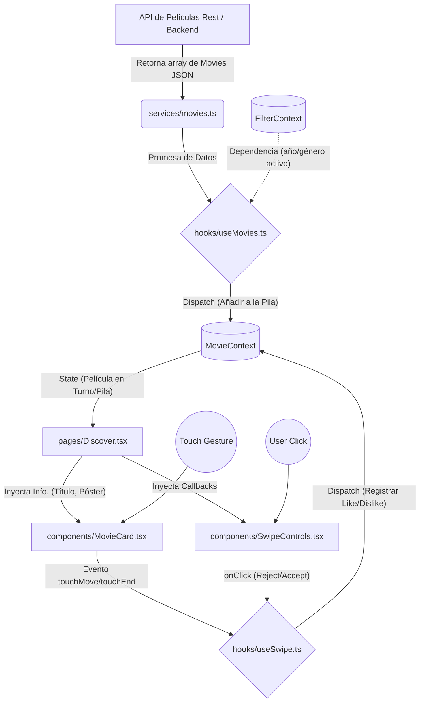

# CineSwipe - Arquitectura del Proyecto

## 1. Estructura de Directorios

El proyecto sigue una arquitectura modular enfocada en la separación de responsabilidades y mantenibilidad, garantizando una profundidad máxima de 3 niveles entre directorios.

```text
src/
├── assets/            # Imágenes, iconos, fuentes y demás recursos estáticos
├── components/        # Componentes de presentación (UI reutilizable, estado estricto de UI)
│   ├── common/        # Botones, inputs, modales genéricos, loaders
│   ├── filters/       # Selectores de género, año y barras de búsqueda
│   └── swipe/         # Tarjetas apilables de películas y controles de botones
├── context/           # Estado global de la aplicación (React Context + useReducer)
│   ├── filter/        # Provider y reducer para los parámetros de búsqueda activos
│   └── movie/         # Provider y reducer para el catálogo y el historial (likes/dislikes)
├── hooks/             # Lógica de negocio extraída de la UI (Custom Hooks)
│   ├── useFilters.ts  # Manejo de la selección de géneros/año y despachos al contexto
│   ├── useMovies.ts   # Peticiones API asíncronas y sincronización con el contexto
│   └── useSwipe.ts    # Modelado físico de gestos táctiles (pan, release) y animaciones
├── pages/             # Vistas de alto nivel (ensamblan hooks y componentes)
│   ├── Discover/      # Pantalla principal (motor de descubrimiento y swipe)
│   └── Likes/         # Pantalla listado o grid de las películas marcadas de forma positiva
├── services/          # Integración externa y acceso a APIs HTTP
│   ├── apiClient.ts   # Configuración de axios/fetch nativo (interceptores de base)
│   └── movies.ts      # Endpoints específicos del negocio (ej. `fetchTrendingMovies`)
├── types/             # Única fuente de la verdad para definiciones TypeScript
│   ├── api.types.ts   # Estructuras de las respuestas HTTP
│   └── movie.types.ts # Entidades modelo (ej: interfaz `Movie`, `Genre`, `RootState`)
├── utils/             # Funciones puras e isoladas
│   └── formatters.ts  # Helpers de fechas, conversiones de monedas o tiempo y strings
├── App.tsx            # Árbol de rutas (React Router u otro) envolviendo los contextos
└── main.tsx           # Punto de inicio (createRoot) de la aplicación React
```

## 2. Responsabilidad por Módulo

| Módulo | Responsabilidad | Archivos Clave de Ejemplo |
| :--- | :--- | :--- |
| **`components/`** | Renderizado puro (JSX) y estilos de Tailwind UI. Totalmente "mudos" (Dumb Components); reciben y emiten datos mediante `props`. | `MovieCard.tsx`, `FilterDropdown.tsx`, `Button.tsx` |
| **`context/`** | Agrupación global del estado y la lógica de mutaciones complejas usando una aproximación tipo Redux, usando puro React Core. | `MovieProvider.tsx`, `movieReducer.ts` |
| **`hooks/`** | Encapsulan lógica imperativa, llamadas a red e interacciones directas con el contexto global para no contaminar la UI. | `useMovies.ts`, `useSwipe.ts`, `useFilters.ts` |
| **`pages/`** | Componentes contenedores (Smart). Conectan hooks para recuperar datos y los inyectan en componentes hijos. Define el esqueleto visual. | `Discover.tsx`, `Likes.tsx` |
| **`services/`** | Abstracción de red que interactúa directamente y transforma las solicitudes HTTP a promesas en JSON entendibles. | `movies.ts`, `apiClient.ts` |
| **`types/`** | Centralizar contratos y evitar declaraciones tipo `any`. Sirven como documentación viva del dominio de datos. | `movie.types.ts`, `context.types.ts` |

## 3. Diagrama de Flujo de Datos

Arquitectura de componentes reaccionando ante eventos y manipulando el árbol con dependencias unidireccionales:



## 4. Convenciones de Naming

- **Páginas y Componentes UI (`.tsx`):** PascalCase siempre. Ej: `MovieCard.tsx`, `Discover.tsx`.
- **Custom Hooks (`.ts`):** camelCase pero obligatoriamente arrancan con prefijo _use_. Ej: `useSwipe.ts`, `useMovies.ts`.
- **Managers, Utilidades, Reducers y API (`.ts`):** camelCase. Ej: `movieReducer.ts`, `apiClient.ts`, `formatters.ts`.
- **Acciones y Constantes Mágicas:** UPPER_SNAKE_CASE. Ej: `ACTION_DISLIKE`, `MAX_SWIPE_DISTANCE_PX`.
- **Tipos e Interfaces:** PascalCase directo sobre dominios. Es preferible omitir el prefijo "I". Ej: `Movie` o `FilterState` en el archivo `movie.types.ts`.
- **Nodos de Estilo (Tailwind Clases):** Clases inyectadas directamente o mapeos mediante variables que respeten el naming de clases nativas asimiladas en diseño.
