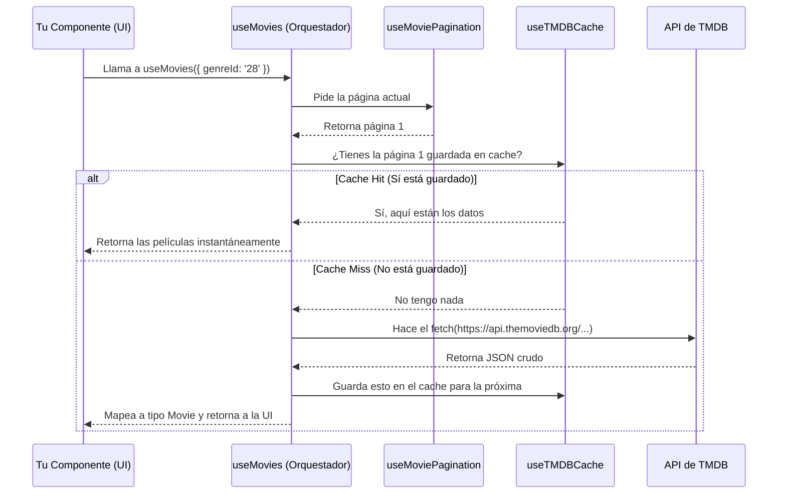

# Guía de Uso: Arquitectura del Hook `useMovies`

¡Hola! Si estás viendo este archivo, probablemente necesites cargar películas desde la API de The Movie Database (TMDB) en tus componentes. Has llegado al lugar indicado.

## 🤔 ¿Por qué dividimos el código en 3 hooks?

Anteriormente, teníamos un solo archivo gigante que hacía de todo: controlaba en qué página estábamos, guardaba datos en la memoria del navegador (cache), hacía las peticiones de red y mapeaba los datos. 

Para hacer el código más limpio, fácil de leer y de probar (testear), lo separamos aplicando el principio de **Responsabilidad Única**:

1. **`useTMDBCache`**: Es el "bibliotecario". Solo sabe guardar y buscar cosas en el `sessionStorage`. No sabe nada de películas ni de páginas.
2. **`useMoviePagination`**: Es el "contador". Solo lleva la cuenta de en qué página estamos (`page`) y si hay más páginas por ver (`hasMore`).
3. **`useMovies` (El Jefe)**: Es el **orquestador**. Este es el *único* hook que tú vas a usar en tus componentes. Se encarga de usar a los otros dos para pedir los datos a TMDB y entregártelos listos para usar en la pantalla.

---

## 🔄 ¿Cómo interactúan entre sí?

Aquí tienes un diagrama sencillo de cómo fluye la información cuando tu componente pide películas:



---

## 🛠️ Cómo usarlo (Ejemplo Práctico)

Como desarrollador, **solo necesitas importar `useMovies`**. Aquí tienes un ejemplo real de cómo crear una galería de películas gestionando correctamente todos los estados:

```tsx
import React from 'react';
import { useMovies } from '../hooks/useMovies';

export const MovieGallery = () => {
  // 1. Llamamos al hook. Opcionalmente le pasamos filtros.
  const { movies, loading, error, loadMore, hasMore } = useMovies({ 
    genreId: '28', // Películas de acción
    year: 2023 
  });

  // 2. Manejo de error crítico (ej. sin internet o API Key inválida)
  if (error && movies.length === 0) {
    return <div className="error-banner">🚨 Error: {error}</div>;
  }

  return (
    <div className="gallery-container">
      {/* 3. Renderizamos las películas que ya tenemos */}
      <div className="movie-grid">
        {movies.map((movie) => (
          <div key={movie.id} className="movie-card">
            
            <h3>{movie.title} ({movie.year})</h3>
            <p>⭐ {movie.rating}</p>
          </div>
        ))}
      </div>

      {/* 4. Mostramos un spinner si está cargando */}
      {loading && <p>Cargando películas mágicas... 🍿</p>}

      {/* 5. Botón para cargar más (Paginación) */}
      {hasMore && !loading && (
        <button onClick={loadMore} className="btn-load">
          Cargar más películas
        </button>
      )}

      {/* 6. Feedback visual si ya vimos todo */}
      {!hasMore && <p>¡Llegaste al final del catálogo! 🎬</p>}
    </div>
  );
};
```

---

## 📚 Referencia de la API

El hook `useMovies` devuelve un objeto con las siguientes propiedades:

| Propiedad | Tipo | Descripción |
| :--- | :--- | :--- |
| `movies` | `Movie[]` | La lista acumulada de películas listas para mostrar. Si estás en la página 2, incluye las de la 1 y la 2. |
| `loading` | `boolean` | `true` si se está realizando una petición a la API. Útil para mostrar spinners. |
| `error` | `string \| null` | Mensaje de error amigable si algo sale mal. `null` si todo está bien. |
| `loadMore` | `() => void` | Función que debes ejecutar (ej. al hacer clic en un botón o al hacer scroll) para pedir la siguiente página. |
| `hasMore` | `boolean` | `true` si la API indica que hay más páginas disponibles. Úsalo para ocultar el botón de "Cargar más". |

---

## ⚠️ Errores Comunes (Anti-patrones)

Para evitar dolores de cabeza, **NUNCA** hagas estas tres cosas:

> [!WARNING]
> **Anti-patrón 1: Usar `useTMDBCache` o `useMoviePagination` directamente en tus componentes.**
> Estos son hooks *internos* (secundarios). Fueron creados solo para que `useMovies` los utilice. Tu componente UI nunca debe importarlos, todo lo que necesitas te lo da `useMovies`.

> [!CAUTION]
> **Anti-patrón 2: Olvidar comprobar `loading` antes de mostrar errores vacíos.**
> Cuando el componente se monta por primera vez, `movies` está vacío y `loading` es `true`. Si muestras una pantalla de "No se encontraron películas" solo evaluando `movies.length === 0`, el usuario verá ese mensaje parpadear por un segundo antes de que lleguen los datos. ¡Combina `movies.length === 0 && !loading`!

> [!IMPORTANT]
> **Anti-patrón 3: Llamar a `loadMore` dentro de un `useEffect` sin precauciones.**
> Si intentas hacer un "infinite scroll" rudimentario y llamas a `loadMore()` cada vez que se hace scroll sin verificar si ya está cargando, lanzarás decenas de peticiones simultáneas a la API, provocando un error `429 Too Many Requests`. El hook ya se protege un poco de esto, pero asegúrate de que tu UI condicione la llamada: `if (!loading && hasMore) loadMore()`.
